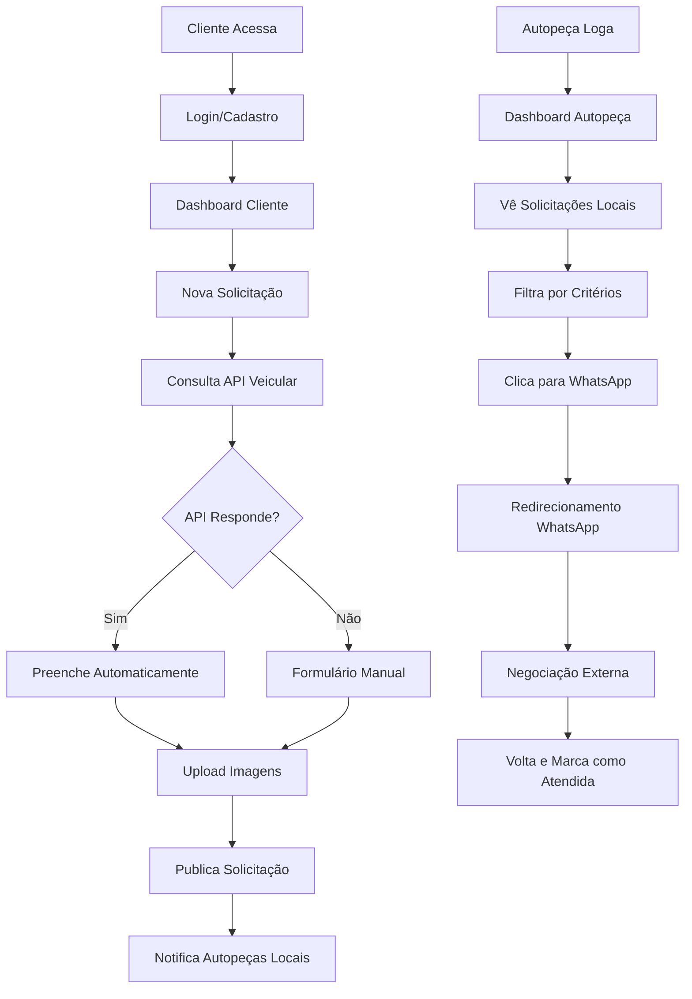

# PeçaJá - Guia de Desenvolvimento

## Visão Geral do Projeto

O **PeçaJá** é uma plataforma web (MVP) que conecta proprietários de veículos/oficinas (clientes) com autopeças, funcionando como um marketplace de solicitação de orçamentos. A aplicação permite que clientes criem solicitações detalhadas de peças automotivas e que autopeças visualizem essas solicitações, filtrem por critérios relevantes e entrem em contato diretamente via WhatsApp.

## Arquitetura e Stack Tecnológica

### Stack Principal
- **Frontend**: React.js com Vite
- **Backend**: Node.js com Express.js
- **Banco de Dados**: PostgreSQL
- **ORM**: Sequelize
- **Autenticação**: JWT + Google OAuth 2.0
- **Testes**: Jest/Vitest
- **Containerização**: Docker
- **CI/CD**: GitHub Actions

### Estrutura de Pastas
```
pecaja/
├── frontend/                 # React application
│   ├── public/
│   ├── src/
│   │   ├── components/      # Componentes reutilizáveis
│   │   ├── pages/          # Páginas da aplicação
│   │   ├── hooks/          # Custom hooks
│   │   ├── services/       # API calls e integrações
│   │   ├── utils/          # Funções utilitárias
│   │   ├── contexts/       # Context API
│   │   └── assets/         # Imagens e recursos
│   ├── package.json
│   └── vite.config.js
├── backend/                  # Node.js API
│   ├── src/
│   │   ├── controllers/    # Controladores MVC
│   │   ├── models/         # Modelos Sequelize
│   │   ├── services/       # Lógica de negócio
│   │   ├── routes/         # Rotas da API
│   │   ├── middleware/     # Middlewares personalizados
│   │   ├── utils/          # Utilitários
│   │   ├── config/         # Configurações
│   │   └── migrations/     # Migrações do banco
│   ├── tests/              # Testes unitários
│   ├── package.json
│   └── server.js
├── docs/                     # Documentação
├── docker-compose.yml        # Docker containers
└── README.md
```

## Modelagem de Dados 

### Entidades Principais

1. **usuarios** - Entidade base para todos os usuários
2. **clientes** - Extends usuarios para proprietários de veículos/oficinas
3. **autopecas** - Extends usuarios para estabelecimentos comerciais
4. **vendedores** - Funcionários das autopeças
5. **solicitacoes** - Pedidos de orçamento criados pelos clientes
6. **imagens_solicitacao** - Imagens anexadas às solicitações
7. **solicitacoes_atendimento** - Controle de atendimento pelas autopeças
8. **notificacoes** - Sistema de notificações
9. **historico_solicitacoes** - Auditoria das alterações

### Relacionamentos Chave
- Usuarios 1:1 Clientes/Autopeças
- Autopeças 1:N Vendedores
- Clientes 1:N Solicitações
- Solicitações 1:N Imagens
- Solicitações N:M Autopeças (através de solicitacoes_atendimento)

## Funcionalidades por Módulo

### 1. Módulo de Autenticação
- **Cadastro de usuários** (clientes e autopeças)
- **Login com email/senha** e **Google OAuth 2.0**
- **Recuperação de senha** via email com token temporário
- **Middleware de autenticação** JWT
- **Controle de sessão** e logout

### 2. Módulo de Usuários
- **Perfis diferenciados**: cliente, autopeça, vendedor
- **Edição de perfil** com validação de dados
- **Exclusão de conta** com confirmação por email
- **Gestão de vendedores** pelas autopeças
- **Sistema de permissões** baseado em roles

### 3. Módulo de Solicitações
- **Criação de solicitações** com dados do veículo
- **Upload de até 3 imagens** por solicitação
- **Integração com API veicular** para preenchimento automático (www.consultarplaca.com.br)
- **Edição e cancelamento** de solicitações ativas
- **Filtros avançados** para autopeças
- **Sistema de busca** por palavras-chave
- **Controle de status** (ativa, concluída, cancelada)

### 4. Módulo de Atendimento
- **Visualização por localização** (mesma cidade)
- **Marcação como "Atendida"** por autopeça/vendedor
- **Controle de conflitos** entre vendedores da mesma autopeça
- **Redirecionamento para WhatsApp**
- **Histórico de atendimentos**

### 5. Módulo de Notificações
- **Notificações por email** para novas solicitações
- **Notificações in-app** para ações importantes

## Requisitos de Implementação

### Frontend - React.js

#### Páginas Principais
1. **Landing Page** - Apresentação da plataforma
2. **Cadastro/Login** - Autenticação com opção Google OAuth
3. **Dashboard Cliente**:
   - Criar nova solicitação
   - Visualizar solicitações ativas
   - Histórico de solicitações
   - Perfil e configurações
4. **Dashboard Autopeça**:
   - Visualizar solicitações disponíveis
   - Filtros e busca
   - Gerenciar vendedores
   - Histórico de atendimentos
5. **Dashboard Vendedor**:
   - Visualizar solicitações não atendidas
   - Marcar como atendida
   - Histórico pessoal

#### Componentes Chave
- **AuthGuard** - Proteção de rotas
- **FileUpload** - Upload de imagens com validação
- **VehicleForm** - Formulário com integração API veicular
- **FilterBar** - Filtros para autopeças
- **RequestCard** - Card de solicitação
- **NotificationBell** - Notificações em tempo real

#### Padrões de UI/UX
- **Design responsivo** (MVP focado em WEB)
- **Loading states** para todas as operações
- **Error boundaries** para tratamento de erros
- **Feedback visual** para ações do usuário

### Backend - Node.js/Express

#### Estrutura de Rotas
```
/api/auth          # Autenticação
/api/users         # Gerenciamento de usuários
/api/clients       # Operações específicas de clientes
/api/autopecas     # Operações específicas de autopeças
/api/sellers       # Gerenciamento de vendedores
/api/requests      # Solicitações
/api/images        # Upload e manipulação de imagens
/api/notifications # Sistema de notificações
/api/vehicle       # Integração API veicular
```

#### Middlewares Essenciais
- **Authentication** - Verificação JWT
- **Authorization** - Controle de permissões por role
- **Validation** - Validação de dados de entrada
- **FileUpload** - Processamento de imagens
- **RateLimit** - Proteção contra DDoS
- **CORS** - Configuração de origens permitidas
- **Logging** - Auditoria de operações

#### Serviços Externos
- **Google OAuth API** - Autenticação social
- **API Veicular** - Consulta de dados por placa ( será utilizado o https://consultarplaca.com.br/)
- **WhatsApp Business API** - Redirecionamento
- **Email Service** - Envio de notificações

### Banco de Dados - PostgreSQL

#### Configuração Inicial
- Implementar migrations com Sequelize
- Configurar índices para performance
- Estabelecer constraints de integridade

#### Otimizações
- **Índices compostos** para consultas frequentes
- **Views materializadas** para relatórios
- **Particionamento** para tabelas grandes (futuro)
- **Connection pooling** para performance

## Padrões de Desenvolvimento

### Código Limpo e Arquitetura
- **Clean Code** - Nomes descritivos, funções pequenas
- **SOLID Principles** - Especialmente SRP e DIP
- **MVC Pattern** - Separação clara de responsabilidades
- **Repository Pattern** - Abstração do acesso a dados
- **Service Layer** - Lógica de negócio isolada

### Testes
- **TDD Approach** - Testes antes da implementação
- **Cobertura mínima** de 70%
- **Testes unitários** para serviços e utilitários
- **Testes de integração** para APIs
- **Testes E2E** para fluxos críticos

### Segurança
- **Input Validation** - Sanitização de todas as entradas
- **SQL Injection Prevention** - Prepared statements
- **XSS Protection** - Escape de outputs
- **CSRF Protection** - Tokens CSRF
- **Rate Limiting** - Proteção contra ataques
- **HTTPS Only** - SSL/TLS obrigatório
- **Secure Headers** - Helmet.js
- **Password Hashing** - bcrypt com salt

### Performance
- **Lazy Loading** - Carregamento sob demanda
- **Image Optimization** - Compressão e redimensionamento
- **Caching Strategy** - Cache de consultas frequentes
- **Database Optimization** - Queries eficientes
- **Bundle Optimization** - Code splitting no frontend

## Fluxos Principais de Usuário

### Cliente
1. **Cadastro/Login** → **Dashboard**
2. **Nova Solicitação** → **Preencher dados veículo** → **Upload imagens** → **Confirmar**
3. **Visualizar status** → **Receber atendimento no WhatsApp** → **Concluir solicitação**

### Autopeça
1. **Cadastro/Login** → **Dashboard**
2. **Visualizar solicitações** → **Filtrar por critério** → **WhatsApp cliente**
3. **Gerenciar vendedores** → **Cadastrar/editar/inativar**

### Vendedor
1. **Receber credenciais** → **Login** → **Dashboard**
2. **Visualizar solicitações não atendidas** → **WhatsApp client** → **Marca como atendida**




## Integrações Externas

### Google OAuth 2.0
- **Client ID/Secret** configuráveis via env
- **Scopes**: email, profile
- **Callback URL** configurada
- **Token refresh** automático

### API Veicular - Consultar Placa
- **Documentação Oficial**: https://docs.consultarplaca.com.br/consultas/consultar-placa
- **Tipo de API**: RESTful
- **Autenticação**: API Key via header
- **Fallback manual** em caso de erro
- **Cache** de consultas por 24h
- **Rate limiting** para evitar custos

### WhatsApp Business
- **Deep linking** para WhatsApp Web

### Docker Configuration
- **Multi-stage builds** para otimização
- **Health checks** para serviços
- **Volume mapping** para persistência
- **Network isolation** para segurança

## Critérios de Aceite por Funcionalidade

### RF01 - Cadastro de Clientes
- [x] Formulário com campos obrigatórios
- [x] Validação de email único
- [x] Validação de formato celular
- [x] Hash da senha com bcrypt
- [x] Confirmação por email

### RF08 - Criação de Solicitações
- [x] Integração com API veicular
- [x] Fallback manual para dados
- [x] Upload de até 3 imagens
- [x] Validação de tipos de arquivo
- [x] Descrição obrigatória da peça

### RF12 - Filtro por Localização
- [x] Solicitações apenas da mesma cidade
- [x] Filtro automático no backend
- [x] Performance otimizada com índices

## Entregas e Milestones

### Sprint 1 - Fundação (Semanas 1-2)
- Configuração do ambiente de desenvolvimento
- Estrutura básica do projeto (frontend + backend)
- Configuração do banco de dados
- Sistema de autenticação básico

### Sprint 2 - Usuários (Semanas 3-4)
- Cadastro e login de clientes e autopeças
- Integração Google OAuth
- Perfis e edição de dados
- Recuperação de senha

### Sprint 3 - Solicitações (Semanas 5-6)
- Criação de solicitações pelos clientes
- Upload de imagens
- Integração API veicular
- Visualização por autopeças

### Sprint 4 - Atendimento (Semanas 7-8)
- Sistema de filtros para autopeças
- Marcação como atendida
- Redirecionamento WhatsApp
- Gestão de vendedores

### Sprint 5 - Notificações e Refinamentos (Semanas 9-10)
- Sistema de notificações
- Testes abrangentes
- Otimizações de performance
- Deploy e documentação final

## Considerações de Deploy

### Ambiente de Produção
- **Cloud Provider**: Heroku, Vercel, ou AWS
- **CDN**: Para assets estáticos
- **SSL Certificate**: Obrigatório
- **Monitoring**: Logs centralizados
- **Scaling**: Horizontal para backend

### CI/CD Pipeline
- **GitHub Actions** para automação
- **Build/Test/Deploy** automático
- **Environment separation** (dev/staging/prod)
- **Rollback strategy** em caso de problemas

Este documento serve como referência completa para o desenvolvimento da plataforma PeçaJá, garantindo que todas as funcionalidades sejam implementadas seguindo as melhores práticas e atendendo aos requisitos acadêmicos estabelecidos.
