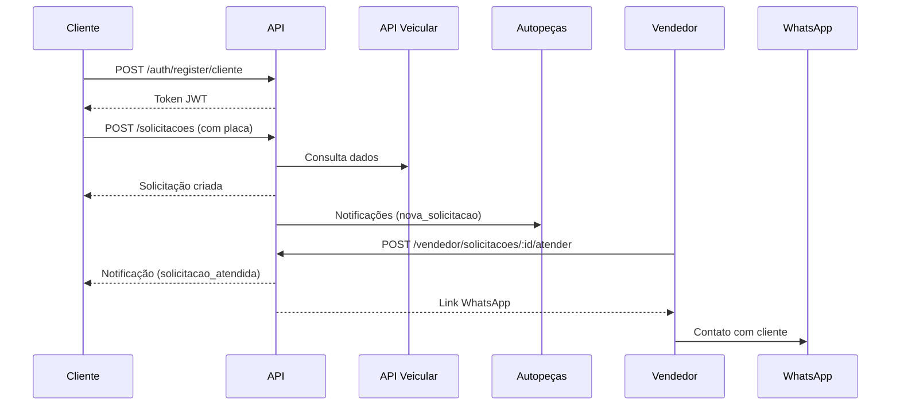

# 📖 API Reference - Guia para Frontend

**Projeto**: PeçaJá - Backend API  
**Versão**: 1.0.0 MVP  
**Data**: 12 de Janeiro de 2025  
**Base URL**: `http://localhost:3000/api` (desenvolvimento)

---

## 📋 SUMÁRIO

1. [Visão Geral](#visão-geral)
2. [Autenticação](#autenticação)
3. [Endpoints por Módulo](#endpoints-por-módulo)
4. [Modelos de Dados](#modelos-de-dados)
5. [Fluxos de Usuário](#fluxos-de-usuário)
6. [Códigos de Status](#códigos-de-status)
7. [Exemplos de Código](#exemplos-de-código)
8. [Notificações](#notificações)
9. [Upload de Imagens](#upload-de-imagens)
10. [Tratamento de Erros](#tratamento-de-erros)

---

## 🎯 VISÃO GERAL

### O que é o PeçaJá?

Plataforma que conecta **proprietários de veículos** com **autopeças**, permitindo que clientes solicitem orçamentos de peças e autopeças/vendedores visualizem e atendam essas solicitações.

### Tipos de Usuário

1. **Cliente** - Proprietário de veículo que solicita peças
2. **Autopeça** - Estabelecimento que atende solicitações
3. **Vendedor** - Funcionário de autopeça

### Fluxo Principal

```
Cliente cria solicitação 
  → Autopeças da cidade são notificadas
  → Vendedor/Autopeça marca como atendida
  → Redirecionamento para WhatsApp
  → Cliente fecha negócio externamente
```

---

## 🔐 AUTENTICAÇÃO

### Sistema de Auth

A API usa **JWT (JSON Web Tokens)** para autenticação.

### Como Funciona

1. Usuário faz login
2. API retorna um `token`
3. Frontend envia o token em todas as requisições protegidas

### Header de Autenticação

```http
Authorization: Bearer SEU_TOKEN_JWT_AQUI
```

### Exemplo Completo

```javascript
const response = await fetch('http://localhost:3000/api/solicitacoes', {
  headers: {
    'Authorization': `Bearer ${localStorage.getItem('token')}`,
    'Content-Type': 'application/json'
  }
});
```

---

## 📍 ENDPOINTS POR MÓDULO

### 1. AUTENTICAÇÃO (`/api/auth`)

#### 1.1. Cadastro de Cliente

**POST** `/api/auth/register/cliente`

**Body:**
```json
{
  "email": "joao@example.com",
  "senha": "senha123",
  "nome_completo": "João Silva",
  "celular": "(11)99999-9999",
  "cpf": "123.456.789-00",
  "cep": "01310100",
  "cidade": "São Paulo",
  "uf": "SP",
  "termos_aceitos": true
}
```

**Resposta (201):**
```json
{
  "success": true,
  "message": "Cliente cadastrado com sucesso",
  "data": {
    "usuario": {
      "id": "uuid",
      "email": "joao@example.com",
      "tipo_usuario": "cliente"
    },
    "cliente": {
      "id": "uuid",
      "nome_completo": "João Silva",
      "celular": "(11)99999-9999"
    },
    "token": "eyJhbGciOiJIUzI1NiIsInR5cCI6IkpXVCJ9..."
  }
}
```

#### 1.2. Cadastro de Autopeça

**POST** `/api/auth/register/autopeca`

**Body:**
```json
{
  "email": "contato@autopeca.com",
  "senha": "senha123",
  "razao_social": "AutoPeças Silva LTDA",
  "nome_fantasia": "Silva Autopeças",
  "cnpj": "12.345.678/0001-90",
  "telefone": "(11)3333-4444",
  "endereco_cep": "01310100",
  "endereco_rua": "Avenida Paulista",
  "endereco_numero": "1000",
  "endereco_bairro": "Bela Vista",
  "endereco_cidade": "São Paulo",
  "endereco_uf": "SP",
  "termos_aceitos": true
}
```

**Resposta (201):** Similar ao cadastro de cliente

#### 1.3. Login

**POST** `/api/auth/login`

**Body:**
```json
{
  "email": "joao@example.com",
  "senha": "senha123"
}
```

**Resposta (200):**
```json
{
  "success": true,
  "message": "Login realizado com sucesso",
  "data": {
    "token": "eyJhbGciOiJIUzI1NiIsInR5cCI6IkpXVCJ9...",
    "usuario": {
      "id": "uuid",
      "email": "joao@example.com",
      "tipo_usuario": "cliente"
    },
    "perfil": {
      "id": "uuid",
      "nome_completo": "João Silva"
    }
  }
}
```

#### 1.4. Recuperação de Senha

**POST** `/api/auth/forgot-password`

**Body:**
```json
{
  "email": "joao@example.com"
}
```

**Resposta (200):**
```json
{
  "success": true,
  "message": "Email de recuperação enviado com sucesso"
}
```

#### 1.5. Logout

**POST** `/api/auth/logout`

**Headers:** `Authorization: Bearer TOKEN`

**Resposta (200):**
```json
{
  "success": true,
  "message": "Logout realizado com sucesso"
}
```

---

### 2. SOLICITAÇÕES (`/api/solicitacoes`)

**Todas as rotas requerem autenticação!**

#### 2.1. Criar Solicitação (Cliente)

**POST** `/api/solicitacoes`

**Headers:** 
- `Authorization: Bearer TOKEN`
- `Content-Type: multipart/form-data`

**Body (FormData):**
```javascript
const formData = new FormData();
formData.append('placa', 'ABC1234');
formData.append('marca', 'FIAT');
formData.append('modelo', 'UNO');
formData.append('ano_fabricacao', '2020');
formData.append('ano_modelo', '2020');
formData.append('categoria', 'carro');
formData.append('cor', 'Branco');
formData.append('descricao_peca', 'Filtro de óleo original');
formData.append('cidade_atendimento', 'São Paulo'); // Opcional
formData.append('uf_atendimento', 'SP'); // Opcional

// Imagens (até 3)
formData.append('imagens', imageFile1);
formData.append('imagens', imageFile2);
```

**Resposta (201):**
```json
{
  "success": true,
  "message": "Solicitação criada com 2 imagem(ns)",
  "data": {
    "solicitacao": {
      "id": "uuid",
      "placa": "ABC1234",
      "marca": "FIAT",
      "modelo": "UNO",
      "ano_fabricacao": 2020,
      "ano_modelo": 2020,
      "categoria": "carro",
      "cor": "Branco",
      "origem_dados_veiculo": "api", // ou "manual"
      "status_cliente": "ativa",
      "cidade_atendimento": "São Paulo",
      "uf_atendimento": "SP",
      "created_at": "2025-01-12T10:00:00Z"
    },
    "imagens": [
      {
        "id": "uuid",
        "nome_arquivo": "imagem1.jpg",
        "url": "/uploads/filename.jpg"
      }
    ],
    "api_veicular_info": {
      "consultado": true,
      "origem": "api",
      "motivo": "sucesso"
    }
  }
}
```

**Nota Importante:** 
- Se a placa for fornecida, a API automaticamente consulta a API Veicular
- Se a consulta falhar, usa os dados manuais fornecidos
- Cidade/UF são opcionais - se não informados, usa do perfil do cliente

#### 2.2. Listar Minhas Solicitações (Cliente)

**GET** `/api/solicitacoes`

**Headers:** `Authorization: Bearer TOKEN`

**Resposta (200):**
```json
{
  "success": true,
  "message": "Solicitações listadas com sucesso",
  "data": {
    "solicitacoes": [
      {
        "id": "uuid",
        "descricao_peca": "Filtro de óleo original",
        "placa": "ABC1234",
        "marca": "FIAT",
        "modelo": "UNO",
        "status_cliente": "ativa",
        "data_criacao": "2025-01-12T10:00:00Z"
      }
    ],
    "total": 5
  }
}
```

#### 2.3. Buscar Solicitação por ID (Cliente)

**GET** `/api/solicitacoes/:id`

**Headers:** `Authorization: Bearer TOKEN`

**Resposta (200):**
```json
{
  "success": true,
  "message": "Solicitação encontrada com sucesso",
  "data": {
    "solicitacao": {
      "id": "uuid",
      "descricao_peca": "Filtro de óleo original",
      "placa": "ABC1234",
      "marca": "FIAT",
      "modelo": "UNO",
      "ano_fabricacao": 2020,
      "ano_modelo": 2020,
      "categoria": "carro",
      "cor": "Branco",
      "chassi": "9BWZZZ377VT004251",
      "renavam": "00012345678",
      "status_cliente": "ativa",
      "cidade_atendimento": "São Paulo",
      "uf_atendimento": "SP",
      "data_criacao": "2025-01-12T10:00:00Z",
      "imagens": [
        {
          "id": "uuid",
          "nome_arquivo": "imagem1.jpg",
          "nome_arquivo_fisico": "1234567890.jpg",
          "ordem_exibicao": 1
        }
      ]
    }
  }
}
```

#### 2.4. Atualizar Solicitação (Cliente)

**PUT** `/api/solicitacoes/:id`

**Headers:** 
- `Authorization: Bearer TOKEN`
- `Content-Type: application/json`

**Body (pode enviar apenas os campos que deseja atualizar):**
```json
{
  "descricao_peca": "Filtro de óleo original Tecfil",
  "cor": "Branco Pérola"
}
```

**Resposta (200):**
```json
{
  "success": true,
  "message": "Solicitação atualizada com sucesso",
  "data": {
    "solicitacao": { /* dados atualizados */ }
  }
}
```

#### 2.5. Cancelar Solicitação (Cliente)

**DELETE** `/api/solicitacoes/:id`

**Headers:** `Authorization: Bearer TOKEN`

**Resposta (200):**
```json
{
  "success": true,
  "message": "Solicitação cancelada com sucesso",
  "data": {
    "solicitacao": {
      "id": "uuid",
      "status_cliente": "cancelada"
    },
    "atendimentos_afetados": 2
  }
}
```

**Nota:** Notificações automáticas são enviadas para autopeças/vendedores que atenderam

---

### 3. AUTOPEÇAS (`/api/autopecas`)

#### 3.1. Ver Perfil da Autopeça

**GET** `/api/autopecas/profile`

**Headers:** `Authorization: Bearer TOKEN`

**Resposta (200):**
```json
{
  "success": true,
  "message": "Perfil da autopeça recuperado com sucesso",
  "data": {
    "autopeca": {
      "id": "uuid",
      "razao_social": "AutoPeças Silva LTDA",
      "nome_fantasia": "Silva Autopeças",
      "cnpj": "12.345.678/0001-90",
      "telefone": "(11)3333-4444",
      "endereco_rua": "Avenida Paulista",
      "endereco_numero": "1000",
      "endereco_bairro": "Bela Vista",
      "endereco_cidade": "São Paulo",
      "endereco_uf": "SP",
      "endereco_cep": "01310100"
    },
    "usuario": {
      "id": "uuid",
      "email": "contato@autopeca.com",
      "tipo_usuario": "autopeca"
    }
  }
}
```

#### 3.2. Atualizar Perfil da Autopeça

**PUT** `/api/autopecas/profile`

**Headers:** 
- `Authorization: Bearer TOKEN`
- `Content-Type: application/json`

**Body:**
```json
{
  "nome_fantasia": "Silva Autopeças Center",
  "telefone": "(11)3333-5555"
}
```

#### 3.3. Ver Solicitações Disponíveis (Autopeça)

**GET** `/api/autopecas/solicitacoes-disponiveis`

**Headers:** `Authorization: Bearer TOKEN`

**Resposta (200):**
```json
{
  "success": true,
  "message": "Solicitações disponíveis recuperadas com sucesso",
  "data": {
    "solicitacoes": [
      {
        "id": "uuid",
        "descricao_peca": "Filtro de óleo original",
        "placa": "ABC1234",
        "marca": "FIAT",
        "modelo": "UNO",
        "ano_fabricacao": 2020,
        "ano_modelo": 2020,
        "categoria": "carro",
        "cor": "Branco",
        "cidade_atendimento": "São Paulo",
        "uf_atendimento": "SP",
        "origem_dados_veiculo": "api",
        "data_criacao": "2025-01-12T10:00:00Z",
        "cliente": {
          "id": "uuid",
          "nome_completo": "João Silva",
          "celular": "(11)99999-9999",
          "cidade": "São Paulo",
          "uf": "SP"
        }
      }
    ],
    "total": 10,
    "filtros": {
      "cidade": "São Paulo",
      "uf": "SP",
      "status": "ativa"
    }
  }
}
```

**Nota:** Só retorna solicitações da mesma cidade da autopeça que ainda não foram atendidas

#### 3.4. Marcar Solicitação como Atendida (Autopeça)

**POST** `/api/autopecas/solicitacoes/:solicitacaoId/atender`

**Headers:** `Authorization: Bearer TOKEN`

**Resposta (200):**
```json
{
  "success": true,
  "message": "Solicitação marcada como atendida com sucesso",
  "data": {
    "atendimento": {
      "id": "uuid",
      "solicitacao_id": "uuid",
      "autopeca_id": "uuid",
      "status_atendimento": "nao_lida",
      "data_marcacao": "2025-01-12T11:00:00Z"
    },
    "cliente": {
      "id": "uuid",
      "nome_completo": "João Silva",
      "celular": "(11)99999-9999"
    },
    "veiculo": {
      "marca": "FIAT",
      "modelo": "UNO",
      "ano_fabricacao": 2020,
      "placa": "ABC1234"
    },
    "link_whatsapp": "https://wa.me/5511999999999?text=Ol%C3%A1...",
    "mensagem_template": "Olá João Silva! 👋\n\nVi sua solicitação..."
  }
}
```

**Nota:** 
- Cliente recebe notificação automática
- Link do WhatsApp vem pronto para uso
- Se outro vendedor da mesma autopeça já atendeu, retorna erro 409

---

### 4. VENDEDORES (`/api/vendedores` e `/api/vendedor`)

#### 4.1. Listar Vendedores (Autopeça)

**GET** `/api/vendedores`

**Headers:** `Authorization: Bearer TOKEN` (deve ser autopeça)

**Resposta (200):**
```json
{
  "success": true,
  "data": {
    "vendedores": [
      {
        "id": "uuid",
        "nome_completo": "Carlos Vendedor",
        "ativo": true,
        "data_criacao": "2025-01-10T10:00:00Z",
        "usuario": {
          "email": "carlos@autopeca.com"
        }
      }
    ],
    "total": 3
  }
}
```

#### 4.2. Criar Vendedor (Autopeça)

**POST** `/api/vendedores`

**Headers:** 
- `Authorization: Bearer TOKEN` (deve ser autopeça)
- `Content-Type: application/json`

**Body:**
```json
{
  "nome_completo": "Carlos Vendedor",
  "email": "carlos@autopeca.com",
  "senha": "senha123"
}
```

**Resposta (201):**
```json
{
  "success": true,
  "message": "Vendedor cadastrado com sucesso",
  "data": {
    "vendedor": {
      "id": "uuid",
      "nome_completo": "Carlos Vendedor",
      "ativo": true
    },
    "usuario": {
      "email": "carlos@autopeca.com"
    },
    "senha_temporaria": "senha123"
  }
}
```

#### 4.3. Dashboard do Vendedor

**GET** `/api/vendedor/dashboard`

**Headers:** `Authorization: Bearer TOKEN` (deve ser vendedor)

**Resposta (200):**
```json
{
  "success": true,
  "data": {
    "vendedor": {
      "id": "uuid",
      "nome_completo": "Carlos Vendedor"
    },
    "autopeca": {
      "nome_fantasia": "Silva Autopeças",
      "cidade": "São Paulo",
      "uf": "SP"
    },
    "estatisticas": {
      "atendimentos_hoje": 5,
      "total_atendimentos": 120,
      "solicitacoes_disponiveis": 15
    }
  }
}
```

#### 4.4. Ver Solicitações Disponíveis (Vendedor)

**GET** `/api/vendedor/solicitacoes-disponiveis`

**Headers:** `Authorization: Bearer TOKEN` (deve ser vendedor)

**Resposta:** Similar a `/api/autopecas/solicitacoes-disponiveis`

#### 4.5. Marcar como Atendida (Vendedor)

**POST** `/api/vendedor/solicitacoes/:solicitacaoId/atender`

**Headers:** `Authorization: Bearer TOKEN` (deve ser vendedor)

**Resposta (200):**
```json
{
  "success": true,
  "message": "Solicitação marcada como atendida com sucesso",
  "data": {
    "atendimento": {
      "id": "uuid",
      "vendedor_id": "uuid",
      "autopeca_id": "uuid"
    },
    "vendedor": {
      "nome_completo": "Carlos Vendedor"
    },
    "link_whatsapp": "https://wa.me/5511999999999?text=...",
    "mensagem_template": "Olá! Sou o Carlos da Silva Autopeças..."
  }
}
```

**Nota:** 
- Cliente recebe notificação
- Admin da autopeça recebe notificação
- Outros vendedores da mesma autopeça recebem notificação de "perdeu_solicitacao"

---

### 5. NOTIFICAÇÕES (`/api/notificacoes`)

#### 5.1. Listar Notificações

**GET** `/api/notificacoes?page=1&limit=20&tipo=nova_solicitacao&lida=false`

**Headers:** `Authorization: Bearer TOKEN`

**Query Parameters:**
- `page` (opcional) - Número da página (padrão: 1)
- `limit` (opcional) - Itens por página (padrão: 20)
- `tipo` (opcional) - Filtrar por tipo
- `lida` (opcional) - Filtrar por lida (true/false)

**Resposta (200):**
```json
{
  "success": true,
  "message": "Notificações listadas com sucesso",
  "data": {
    "notificacoes": [
      {
        "id": "uuid",
        "tipo_notificacao": "nova_solicitacao",
        "titulo": "🚨 Nova Solicitação na Sua Cidade",
        "mensagem": "Nova solicitação de Filtro de óleo para FIAT UNO em São Paulo",
        "lida": false,
        "metadados": {
          "solicitacao_id": "uuid",
          "marca": "FIAT",
          "modelo": "UNO"
        },
        "data_criacao": "2025-01-12T10:00:00Z"
      }
    ],
    "paginacao": {
      "total": 50,
      "pagina_atual": 1,
      "total_paginas": 3,
      "limite_por_pagina": 20,
      "tem_proxima": true,
      "tem_anterior": false
    },
    "filtros_aplicados": {
      "tipo": "nova_solicitacao",
      "lida": false
    }
  }
}
```

#### 5.2. Contar Notificações Não Lidas

**GET** `/api/notificacoes/nao-lidas/contagem`

**Headers:** `Authorization: Bearer TOKEN`

**Resposta (200):**
```json
{
  "success": true,
  "message": "Contagem de notificações não lidas",
  "data": {
    "total_nao_lidas": 15,
    "por_tipo": {
      "nova_solicitacao": 10,
      "solicitacao_atendida": 3,
      "vendedor_atendeu": 2
    }
  }
}
```

**Uso:** Perfeito para badge de notificações!

#### 5.3. Marcar como Lida

**PUT** `/api/notificacoes/:id/ler`

**Headers:** `Authorization: Bearer TOKEN`

**Resposta (200):**
```json
{
  "success": true,
  "message": "Notificação marcada como lida",
  "data": {
    "notificacao": {
      "id": "uuid",
      "lida": true
    }
  }
}
```

#### 5.4. Marcar Todas como Lidas

**PUT** `/api/notificacoes/ler-todas`

**Headers:** `Authorization: Bearer TOKEN`

**Resposta (200):**
```json
{
  "success": true,
  "message": "15 notificação(ões) marcada(s) como lida(s)",
  "data": {
    "quantidade_atualizada": 15
  }
}
```

#### 5.5. Deletar Notificação

**DELETE** `/api/notificacoes/:id`

**Headers:** `Authorization: Bearer TOKEN`

**Resposta (200):**
```json
{
  "success": true,
  "message": "Notificação deletada com sucesso",
  "data": {
    "notificacao_id": "uuid"
  }
}
```

#### Tipos de Notificação

| Tipo | Para Quem | Quando |
|------|-----------|--------|
| `nova_solicitacao` | Autopeças/Vendedores | Cliente cria solicitação |
| `solicitacao_atendida` | Cliente | Autopeça/vendedor atende |
| `solicitacao_cancelada` | Todos envolvidos | Cliente cancela |
| `vendedor_atendeu` | Admin da autopeça | Vendedor atende |
| `perdeu_solicitacao` | Outros vendedores | Colega atendeu primeiro |
| `conflito_atendimento` | Admin da autopeça | Dois vendedores simultâneos |

---

### 6. CONSULTA VEICULAR (`/api/vehicle`)

#### 6.1. Consultar Placa

**GET** `/api/vehicle/consultar?placa=ABC1234`

**Headers:** `Authorization: Bearer TOKEN`

**Query Parameters:**
- `placa` (obrigatório) - Placa do veículo

**Resposta (200):**
```json
{
  "success": true,
  "message": "Veículo encontrado com sucesso",
  "data": {
    "placa": "ABC1234",
    "marca": "FIAT",
    "modelo": "UNO VIVACE 1.0 EVO",
    "ano_fabricacao": 2020,
    "ano_modelo": 2020,
    "categoria": "carro",
    "cor": "BRANCA",
    "chassi": "9BWZZZ377VT004251",
    "renavam": "00012345678",
    "municipio": "SAO PAULO",
    "uf": "SP"
  },
  "api_info": {
    "consultado": true,
    "origem": "api",
    "timestamp": "2025-01-12T10:00:00Z"
  }
}
```

**Nota:** 
- Esta rota já é chamada automaticamente pelo middleware ao criar solicitação
- Pode ser usada para validação de placa antes do envio do formulário

---

## 📊 MODELOS DE DADOS

### Cliente

```typescript
interface Cliente {
  id: string; // UUID
  usuario_id: string; // UUID
  nome_completo: string;
  celular: string; // "(11)99999-9999"
  cpf: string; // "123.456.789-00"
  cep: string; // "01310100"
  cidade: string;
  uf: string; // 2 caracteres
  data_criacao: string; // ISO 8601
  data_atualizacao: string; // ISO 8601
}
```

### Autopeça

```typescript
interface Autopeca {
  id: string;
  usuario_id: string;
  razao_social: string;
  nome_fantasia: string;
  cnpj: string; // "12.345.678/0001-90"
  telefone: string; // "(11)3333-4444"
  endereco_rua: string;
  endereco_numero: string;
  endereco_bairro: string;
  endereco_cidade: string;
  endereco_uf: string; // 2 caracteres
  endereco_cep: string; // "01310100"
  data_criacao: string;
  data_atualizacao: string;
}
```

### Solicitação

```typescript
interface Solicitacao {
  id: string;
  cliente_id: string;
  descricao_peca: string;
  placa: string; // "ABC1234"
  marca: string;
  modelo: string;
  ano_fabricacao: number;
  ano_modelo: number;
  categoria: 'carro' | 'moto' | 'caminhao' | 'van' | 'onibus' | 'outro';
  cor: string;
  chassi?: string;
  renavam?: string;
  status_cliente: 'ativa' | 'concluida' | 'cancelada';
  cidade_atendimento: string;
  uf_atendimento: string;
  origem_dados_veiculo: 'manual' | 'api';
  api_veicular_metadata?: object;
  data_criacao: string;
  data_atualizacao: string;
}
```

### Notificação

```typescript
interface Notificacao {
  id: string;
  usuario_id: string;
  tipo_notificacao: 
    | 'nova_solicitacao' 
    | 'solicitacao_atendida'
    | 'solicitacao_cancelada'
    | 'vendedor_atendeu'
    | 'perdeu_solicitacao'
    | 'conflito_atendimento';
  titulo: string;
  mensagem: string;
  lida: boolean;
  metadados?: {
    solicitacao_id?: string;
    autopeca_id?: string;
    vendedor_id?: string;
    [key: string]: any;
  };
  data_criacao: string;
}
```

---

## 🔄 FLUXOS DE USUÁRIO

### Fluxo do Cliente



### Fluxo da Autopeça

```
1. Cadastro/Login
2. Ver solicitações disponíveis (mesma cidade)
3. Marcar como atendida
4. Receber link do WhatsApp
5. Contatar cliente
6. Fechar negócio
```

### Fluxo do Vendedor

```
1. Receber credenciais do admin
2. Login
3. Ver dashboard com estatísticas
4. Ver solicitações disponíveis
5. Marcar como atendida
6. Contatar cliente via WhatsApp
```

---

## 🚨 CÓDIGOS DE STATUS

### Sucesso

| Código | Significado | Uso |
|--------|-------------|-----|
| **200** | OK | Operação bem-sucedida |
| **201** | Created | Recurso criado com sucesso |

### Erros do Cliente

| Código | Significado | Uso |
|--------|-------------|-----|
| **400** | Bad Request | Dados inválidos ou faltando |
| **401** | Unauthorized | Token ausente ou inválido |
| **403** | Forbidden | Sem permissão para a operação |
| **404** | Not Found | Recurso não encontrado |
| **409** | Conflict | Conflito (ex: vendedor já atendeu) |

### Erros do Servidor

| Código | Significado | Uso |
|--------|-------------|-----|
| **500** | Internal Server Error | Erro interno do servidor |

---

## 💻 EXEMPLOS DE CÓDIGO

### 1. Service de API (React/TypeScript)

```typescript
// src/services/api.ts
import axios from 'axios';

const api = axios.create({
  baseURL: 'http://localhost:3000/api',
  headers: {
    'Content-Type': 'application/json',
  },
});

// Interceptor para adicionar token automaticamente
api.interceptors.request.use((config) => {
  const token = localStorage.getItem('token');
  if (token) {
    config.headers.Authorization = `Bearer ${token}`;
  }
  return config;
});

// Interceptor para tratar erros
api.interceptors.response.use(
  (response) => response,
  (error) => {
    if (error.response?.status === 401) {
      // Token inválido - redirecionar para login
      localStorage.removeItem('token');
      window.location.href = '/login';
    }
    return Promise.reject(error);
  }
);

export default api;
```

### 2. Hook de Autenticação

```typescript
// src/hooks/useAuth.ts
import { useState, useEffect } from 'react';
import api from '../services/api';

interface User {
  id: string;
  email: string;
  tipo_usuario: string;
  perfil: any;
}

export function useAuth() {
  const [user, setUser] = useState<User | null>(null);
  const [loading, setLoading] = useState(true);

  useEffect(() => {
    const token = localStorage.getItem('token');
    const userData = localStorage.getItem('user');
    
    if (token && userData) {
      setUser(JSON.parse(userData));
    }
    setLoading(false);
  }, []);

  const login = async (email: string, senha: string) => {
    const response = await api.post('/auth/login', { email, senha });
    const { token, usuario, perfil } = response.data.data;
    
    localStorage.setItem('token', token);
    localStorage.setItem('user', JSON.stringify({ ...usuario, perfil }));
    setUser({ ...usuario, perfil });
    
    return response.data;
  };

  const logout = () => {
    localStorage.removeItem('token');
    localStorage.removeItem('user');
    setUser(null);
  };

  const register = async (tipo: 'cliente' | 'autopeca', data: any) => {
    const response = await api.post(`/auth/register/${tipo}`, data);
    const { token, usuario, perfil } = response.data.data;
    
    localStorage.setItem('token', token);
    localStorage.setItem('user', JSON.stringify({ ...usuario, perfil }));
    setUser({ ...usuario, perfil });
    
    return response.data;
  };

  return { user, loading, login, logout, register };
}
```

### 3. Hook de Notificações

```typescript
// src/hooks/useNotifications.ts
import { useState, useEffect } from 'react';
import api from '../services/api';

export function useNotifications() {
  const [count, setCount] = useState(0);
  const [notifications, setNotifications] = useState([]);

  const fetchCount = async () => {
    try {
      const response = await api.get('/notificacoes/nao-lidas/contagem');
      setCount(response.data.data.total_nao_lidas);
    } catch (error) {
      console.error('Erro ao buscar contagem:', error);
    }
  };

  const fetchNotifications = async (params = {}) => {
    try {
      const response = await api.get('/notificacoes', { params });
      setNotifications(response.data.data.notificacoes);
      return response.data;
    } catch (error) {
      console.error('Erro ao buscar notificações:', error);
      throw error;
    }
  };

  const markAsRead = async (id: string) => {
    try {
      await api.put(`/notificacoes/${id}/ler`);
      await fetchCount();
      await fetchNotifications();
    } catch (error) {
      console.error('Erro ao marcar como lida:', error);
    }
  };

  const markAllAsRead = async () => {
    try {
      await api.put('/notificacoes/ler-todas');
      await fetchCount();
      await fetchNotifications();
    } catch (error) {
      console.error('Erro ao marcar todas:', error);
    }
  };

  useEffect(() => {
    fetchCount();
    // Atualizar a cada 30 segundos
    const interval = setInterval(fetchCount, 30000);
    return () => clearInterval(interval);
  }, []);

  return {
    count,
    notifications,
    fetchNotifications,
    markAsRead,
    markAllAsRead,
    refresh: fetchCount,
  };
}
```

### 4. Componente de Notificações

```tsx
// src/components/NotificationBell.tsx
import React, { useState } from 'react';
import { useNotifications } from '../hooks/useNotifications';

export function NotificationBell() {
  const { count, notifications, fetchNotifications, markAsRead } = useNotifications();
  const [isOpen, setIsOpen] = useState(false);

  const handleOpen = async () => {
    if (!isOpen) {
      await fetchNotifications({ limit: 10 });
    }
    setIsOpen(!isOpen);
  };

  return (
    <div className="relative">
      <button onClick={handleOpen} className="relative">
        🔔
        {count > 0 && (
          <span className="absolute -top-1 -right-1 bg-red-500 text-white text-xs rounded-full w-5 h-5 flex items-center justify-center">
            {count}
          </span>
        )}
      </button>

      {isOpen && (
        <div className="absolute right-0 mt-2 w-80 bg-white rounded-lg shadow-lg z-50">
          <div className="p-4 border-b">
            <h3 className="font-bold">Notificações</h3>
          </div>
          <div className="max-h-96 overflow-y-auto">
            {notifications.length === 0 ? (
              <p className="p-4 text-gray-500">Nenhuma notificação</p>
            ) : (
              notifications.map((notif: any) => (
                <div
                  key={notif.id}
                  className={`p-4 border-b cursor-pointer hover:bg-gray-50 ${
                    !notif.lida ? 'bg-blue-50' : ''
                  }`}
                  onClick={() => markAsRead(notif.id)}
                >
                  <p className="font-semibold">{notif.titulo}</p>
                  <p className="text-sm text-gray-600">{notif.mensagem}</p>
                  <p className="text-xs text-gray-400 mt-1">
                    {new Date(notif.data_criacao).toLocaleString('pt-BR')}
                  </p>
                </div>
              ))
            )}
          </div>
        </div>
      )}
    </div>
  );
}
```

### 5. Criar Solicitação com Upload

```tsx
// src/components/CreateSolicitacao.tsx
import React, { useState } from 'react';
import api from '../services/api';

export function CreateSolicitacao() {
  const [formData, setFormData] = useState({
    placa: '',
    descricao_peca: '',
    // ... outros campos
  });
  const [imagens, setImagens] = useState<File[]>([]);
  const [loading, setLoading] = useState(false);

  const handleSubmit = async (e: React.FormEvent) => {
    e.preventDefault();
    setLoading(true);

    try {
      const data = new FormData();
      
      // Adicionar campos de texto
      Object.keys(formData).forEach(key => {
        data.append(key, formData[key]);
      });

      // Adicionar imagens
      imagens.forEach(imagem => {
        data.append('imagens', imagem);
      });

      const response = await api.post('/solicitacoes', data, {
        headers: {
          'Content-Type': 'multipart/form-data',
        },
      });

      alert('Solicitação criada com sucesso!');
      console.log(response.data);
    } catch (error) {
      console.error('Erro ao criar solicitação:', error);
      alert('Erro ao criar solicitação');
    } finally {
      setLoading(false);
    }
  };

  const handleImageChange = (e: React.ChangeEvent<HTMLInputElement>) => {
    if (e.target.files) {
      const files = Array.from(e.target.files).slice(0, 3); // Máximo 3
      setImagens(files);
    }
  };

  return (
    <form onSubmit={handleSubmit}>
      <input
        type="text"
        placeholder="Placa (ex: ABC1234)"
        value={formData.placa}
        onChange={(e) => setFormData({ ...formData, placa: e.target.value })}
        required
      />

      <textarea
        placeholder="Descrição da peça"
        value={formData.descricao_peca}
        onChange={(e) => setFormData({ ...formData, descricao_peca: e.target.value })}
        required
      />

      <input
        type="file"
        accept="image/*"
        multiple
        onChange={handleImageChange}
      />
      <p className="text-sm text-gray-500">
        {imagens.length} de 3 imagens selecionadas
      </p>

      <button type="submit" disabled={loading}>
        {loading ? 'Criando...' : 'Criar Solicitação'}
      </button>
    </form>
  );
}
```

---

## 🚨 TRATAMENTO DE ERROS

### Estrutura de Erro Padrão

```json
{
  "success": false,
  "message": "Descrição do erro",
  "errors": {
    "campo": "Descrição específica do erro no campo"
  }
}
```

### Exemplos de Erros

#### 400 - Dados Inválidos
```json
{
  "success": false,
  "message": "Campos obrigatórios não fornecidos",
  "errors": {
    "campos_faltando": ["placa", "descricao_peca"],
    "message": "Os seguintes campos são obrigatórios: placa, descricao_peca"
  }
}
```

#### 401 - Não Autenticado
```json
{
  "success": false,
  "message": "Token não fornecido",
  "errors": {
    "auth": "É necessário estar autenticado para acessar este recurso"
  }
}
```

#### 403 - Sem Permissão
```json
{
  "success": false,
  "message": "Acesso negado",
  "errors": {
    "tipo_usuario": "Esta operação é exclusiva para autopeças"
  }
}
```

#### 404 - Não Encontrado
```json
{
  "success": false,
  "message": "Solicitação não encontrada",
  "errors": {
    "solicitacao": "Solicitação não existe ou não pertence ao usuário"
  }
}
```

#### 409 - Conflito
```json
{
  "success": false,
  "message": "Conflito de atendimento",
  "errors": {
    "conflito": "Outro vendedor desta autopeça já atendeu esta solicitação"
  }
}
```

### Tratamento no Frontend

```typescript
try {
  const response = await api.post('/solicitacoes', data);
  // Sucesso
} catch (error) {
  if (error.response) {
    // Erro da API
    const { status, data } = error.response;
    
    switch (status) {
      case 400:
        alert(`Dados inválidos: ${data.message}`);
        break;
      case 401:
        alert('Sessão expirada. Faça login novamente.');
        // Redirecionar para login
        break;
      case 403:
        alert('Você não tem permissão para esta ação');
        break;
      case 404:
        alert('Recurso não encontrado');
        break;
      case 409:
        alert(`Conflito: ${data.message}`);
        break;
      default:
        alert('Erro ao processar solicitação');
    }
  } else {
    // Erro de rede
    alert('Erro de conexão. Verifique sua internet.');
  }
}
```

---

## 📱 INTEGRAÇÃO WHATSAPP

### Como Funciona

Quando uma autopeça/vendedor marca uma solicitação como atendida, a API retorna um link do WhatsApp pronto para uso:

```json
{
  "link_whatsapp": "https://wa.me/5511999999999?text=Ol%C3%A1%20Jo%C3%A3o%20Silva...",
  "mensagem_template": "Olá João Silva! 👋\n\nVi sua solicitação de..."
}
```

### Uso no Frontend

```tsx
// Após marcar como atendida
const response = await api.post(`/autopecas/solicitacoes/${id}/atender`);
const { link_whatsapp } = response.data.data;

// Abrir WhatsApp
window.open(link_whatsapp, '_blank');
```

### Template da Mensagem

A API gera automaticamente uma mensagem profissional:

```
Olá [Nome do Cliente]! 👋

Vi sua solicitação de [Descrição da Peça] para [Marca Modelo Ano] no PeçaJá.

Sou da [Nome da Autopeça] e gostaria de ajudar você com essa peça.

Podemos conversar sobre preço e disponibilidade? 😊

Atenciosamente,
Equipe [Nome da Autopeça]
```

---

## 🎨 COMPONENTES SUGERIDOS PARA O FRONTEND

### 1. Páginas Essenciais

```
/login                    - Login universal
/cadastro/cliente        - Cadastro de cliente
/cadastro/autopeca       - Cadastro de autopeça

/cliente/dashboard       - Dashboard do cliente
/cliente/solicitacoes    - Listar solicitações
/cliente/nova-solicitacao - Criar solicitação
/cliente/perfil          - Editar perfil

/autopeca/dashboard      - Dashboard da autopeça
/autopeca/solicitacoes   - Ver solicitações disponíveis
/autopeca/vendedores     - Gerenciar vendedores
/autopeca/perfil         - Editar perfil

/vendedor/dashboard      - Dashboard do vendedor
/vendedor/solicitacoes   - Ver e atender solicitações
```

### 2. Componentes Globais

- **NotificationBell** - Sino de notificações com badge
- **Header** - Cabeçalho com navegação e notificações
- **AuthGuard** - Proteção de rotas
- **LoadingSpinner** - Indicador de carregamento
- **ErrorBoundary** - Tratamento de erros
- **Toast** - Notificações temporárias

### 3. Componentes Específicos

- **SolicitacaoCard** - Card de solicitação
- **SolicitacaoForm** - Formulário de criação
- **VehicleDataForm** - Formulário com consulta de placa
- **ImageUpload** - Upload de imagens (máx 3)
- **FilterBar** - Barra de filtros para autopeças
- **VendedorList** - Lista de vendedores
- **WhatsAppButton** - Botão de contato

---

## 🔧 CONFIGURAÇÃO DO PROJETO FRONTEND

### 1. Instalar Dependências

```bash
npm install axios
npm install react-router-dom
npm install @tanstack/react-query  # Para cache e refetch
```

### 2. Variáveis de Ambiente

Criar `.env`:

```env
VITE_API_URL=http://localhost:3000/api
```

### 3. Configurar Axios

```typescript
// src/services/api.ts
import axios from 'axios';

const api = axios.create({
  baseURL: import.meta.env.VITE_API_URL,
});

// Adicionar interceptors aqui...

export default api;
```

### 4. Configurar Rotas

```tsx
// src/App.tsx
import { BrowserRouter, Routes, Route } from 'react-router-dom';
import { AuthProvider } from './contexts/AuthContext';
import { PrivateRoute } from './components/PrivateRoute';

function App() {
  return (
    <AuthProvider>
      <BrowserRouter>
        <Routes>
          <Route path="/login" element={<Login />} />
          <Route path="/cadastro/cliente" element={<CadastroCliente />} />
          
          <Route element={<PrivateRoute tipo="cliente" />}>
            <Route path="/cliente/dashboard" element={<ClienteDashboard />} />
          </Route>
          
          <Route element={<PrivateRoute tipo="autopeca" />}>
            <Route path="/autopeca/dashboard" element={<AutopecaDashboard />} />
          </Route>
          
          {/* ... outras rotas */}
        </Routes>
      </BrowserRouter>
    </AuthProvider>
  );
}
```

---

## ✅ CHECKLIST PARA COMEÇAR

### Etapa 1: Setup Inicial
- [ ] Clonar repositório
- [ ] Configurar variáveis de ambiente (`.env`)
- [ ] Instalar dependências (`npm install`)
- [ ] Configurar Axios com interceptors
- [ ] Criar estrutura de pastas

### Etapa 2: Autenticação
- [ ] Criar hook `useAuth`
- [ ] Criar páginas de Login
- [ ] Criar páginas de Cadastro (Cliente e Autopeça)
- [ ] Implementar AuthGuard
- [ ] Testar fluxo de login/logout

### Etapa 3: Dashboard Cliente
- [ ] Criar dashboard do cliente
- [ ] Criar formulário de solicitação
- [ ] Implementar upload de imagens
- [ ] Listar solicitações do cliente
- [ ] Implementar edição/cancelamento

### Etapa 4: Dashboard Autopeça
- [ ] Criar dashboard da autopeça
- [ ] Listar solicitações disponíveis
- [ ] Implementar filtros
- [ ] Botão "Atender" com WhatsApp
- [ ] Gerenciar vendedores

### Etapa 5: Dashboard Vendedor
- [ ] Criar dashboard do vendedor
- [ ] Listar solicitações
- [ ] Botão "Atender" com WhatsApp
- [ ] Estatísticas

### Etapa 6: Notificações
- [ ] Criar hook `useNotifications`
- [ ] Implementar NotificationBell
- [ ] Listar notificações
- [ ] Marcar como lida
- [ ] Auto-refresh (polling ou WebSocket)

### Etapa 7: Refinamentos
- [ ] Tratamento de erros global
- [ ] Loading states
- [ ] Validações de formulário
- [ ] Responsividade
- [ ] Testes

---

## 🆘 SUPORTE E DÚVIDAS

### Documentação Adicional

- **Notificações**: `docs/SISTEMA-NOTIFICACOES.md`
- **Exemplos**: `docs/EXEMPLO-USO-NOTIFICACOES.md`
- **Deploy**: `PREPARACAO-PRODUCAO.md`

### Testando a API

Use **Postman** ou **Insomnia** para testar endpoints:

1. Importe a coleção (ou crie manualmente)
2. Configure a variável `baseURL`
3. Teste o fluxo de autenticação
4. Salve o token retornado
5. Teste endpoints protegidos

### Health Check

```bash
curl http://localhost:3000/api/health
```

Resposta:
```json
{
  "status": "OK",
  "message": "API do PeçaJá está funcionando!"
}
```

---

## 🎉 PRONTO PARA COMEÇAR!

Você agora tem todas as informações necessárias para implementar o frontend do PeçaJá!

### Fluxo Recomendado

1. **Setup** inicial do projeto
2. **Autenticação** primeiro (login/cadastro)
3. **Dashboard Cliente** (criar e listar solicitações)
4. **Dashboard Autopeça** (ver e atender solicitações)
5. **Notificações** (sistema in-app)
6. **Refinamentos** (UI/UX, loading, erros)

### Links Úteis

- **API Base**: `http://localhost:3000/api`
- **Swagger/Docs**: (pode ser implementado)
- **GitHub**: (link do repositório)

---

**Boa sorte no desenvolvimento! 🚀**

Se tiver dúvidas, consulte este documento ou entre em contato com a equipe backend.

**PeçaJá - Conectando Veículos e Autopeças** 🚗✨


