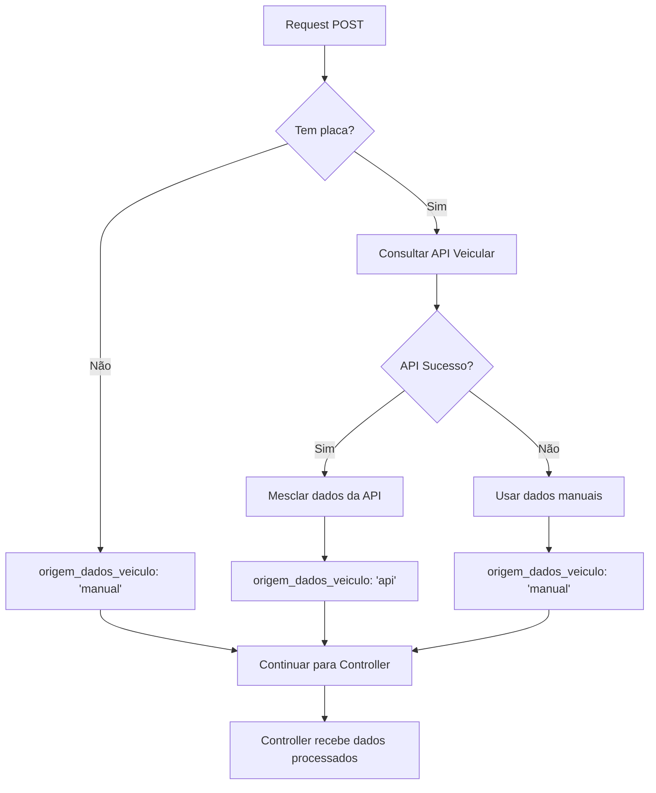

# 🚗 Middleware de Consulta Veicular

## 📋 Visão Geral

O **ConsultaVeicularMiddleware** é um middleware inteligente que intercepta automaticamente requests POST para criação de solicitações, consulta a API veicular quando uma placa é fornecida, e mescla os dados automaticamente no request. Se a API falhar, continua silenciosamente com dados manuais.

## ✨ Funcionalidades

### ✅ **Implementadas**

- ✅ **Interceptação automática** de requests POST
- ✅ **Consulta da API veicular** quando placa é fornecida
- ✅ **Mesclagem automática** de dados da API com request
- ✅ **Fallback silencioso** para dados manuais se API falhar
- ✅ **Campo origem_dados_veiculo** automático
- ✅ **Logging detalhado** de consultas
- ✅ **Middleware específico** para rotas de solicitações
- ✅ **Informações de contexto** no request

## 🔧 Middlewares Disponíveis

### **1. consultaVeicularMiddleware**

Middleware geral que intercepta todos os requests POST.

### **2. consultaVeicularSolicitacoesMiddleware**

Middleware específico que atua apenas em rotas de solicitações.

### **3. logConsultaVeicularMiddleware**

Middleware de logging que registra informações sobre consultas realizadas.

## 📚 Como Usar

### **1. Importação**

```javascript
const {
  consultaVeicularMiddleware,
  consultaVeicularSolicitacoesMiddleware,
  logConsultaVeicularMiddleware,
} = require("./src/middleware");
```

### **2. Uso Geral (Todos os POSTs)**

```javascript
const express = require("express");
const app = express();

// Middleware para parsing de JSON
app.use(express.json());

// Middleware de consulta veicular (todos os POSTs)
app.use(consultaVeicularMiddleware);

// Middleware de logging
app.use(logConsultaVeicularMiddleware);

// Rotas
app.post("/api/solicitacoes", (req, res) => {
  // req.body já contém dados da API veicular se placa foi fornecida
  console.log("Dados processados:", req.body);
  console.log("Info da API:", req.apiVeicularInfo);
});
```

### **3. Uso Específico (Apenas Solicitações)**

```javascript
const express = require("express");
const router = express.Router();

// Middleware específico para rotas de solicitações
router.use(consultaVeicularSolicitacoesMiddleware);

// Middleware de logging
router.use(logConsultaVeicularMiddleware);

// Rotas de solicitações
router.post("/", (req, res) => {
  // Dados já processados pelo middleware
});
```

### **4. Integração nas Rotas Existentes**

```javascript
// backend/src/routes/solicitacaoRoutes.js
const {
  authMiddleware,
  consultaVeicularSolicitacoesMiddleware,
  logConsultaVeicularMiddleware,
} = require("../middleware");

// Middlewares aplicados
router.use(authMiddleware);
router.use(consultaVeicularSolicitacoesMiddleware);
router.use(logConsultaVeicularMiddleware);

// Rotas
router.post("/", uploadMiddleware, solicitacaoController.create);
```

## 🔄 Fluxo de Funcionamento



## 📊 Dados Processados

### **Request Original**

```javascript
{
  placa: "ABC1234",
  descricao_peca: "Peça de teste",
  cidade_atendimento: "São Paulo",
  uf_atendimento: "SP"
}
```

### **Request Processado (com API)**

```javascript
{
  // Dados originais
  placa: "ABC1234",
  descricao_peca: "Peça de teste",
  cidade_atendimento: "São Paulo",
  uf_atendimento: "SP",

  // Dados da API veicular (mesclados automaticamente)
  marca: "Volkswagen",
  modelo: "Golf",
  ano_fabricacao: 2020,
  ano_modelo: 2020,
  categoria: "carro",
  cor: "Branco",
  chassi: "9BWZZZ377VT004251",
  renavam: "12345678901",

  // Metadados
  origem_dados_veiculo: "api",
  api_veicular_metadata: {
    consultado_em: "2024-09-21T01:55:04.933Z",
    api_original_data: { /* dados originais da API */ },
    versao_api: "1.0"
  }
}
```

### **Request Processado (sem API)**

```javascript
{
  // Dados originais
  placa: "ABC1234",
  descricao_peca: "Peça de teste",
  cidade_atendimento: "São Paulo",
  uf_atendimento: "SP",

  // Dados manuais (fallback)
  marca: "Não informado",
  modelo: "Não informado",
  ano_fabricacao: 2025,
  ano_modelo: 2025,
  categoria: "outro",
  cor: "Não informado",
  chassi: "Não informado",
  renavam: "Não informado",

  // Metadados
  origem_dados_veiculo: "manual"
}
```

## 🔍 Informações de Contexto

### **req.apiVeicularInfo**

O middleware adiciona informações sobre a consulta no objeto `req.apiVeicularInfo`:

```javascript
{
  consultado: true,
  origem: "api", // "api", "cache", "manual"
  motivo: "sucesso", // "sucesso", "api_falhou", "dados_invalidos", "erro_critico"
  placa: "ABC1234",
  timestamp: "2024-09-21T01:55:04.933Z",
  erro: "Mensagem de erro" // apenas se houver erro
}
```

## 📝 Logging Automático

### **Logs de Consulta**

O middleware registra automaticamente:

- ✅ Consultas realizadas
- ✅ Resultados obtidos
- ✅ Erros ocorridos
- ✅ Tempo de processamento
- ✅ Status da resposta

### **Exemplo de Log**

```
🔍 Middleware: Consultando API veicular para placa: ABC1234
✅ Middleware: Dados da API veicular mesclados (origem: api)
📊 Log Consulta Veicular: {
  placa: "ABC1234",
  origem: "api",
  motivo: "sucesso",
  timestamp: "2024-09-21T01:55:04.933Z",
  statusCode: 201,
  endpoint: "POST /api/solicitacoes"
}
```

## 🛡️ Tratamento de Erros

### **Tipos de Erro Tratados**

1. **API Indisponível** - Continua com dados manuais
2. **Placa Inválida** - Continua com dados manuais
3. **Timeout** - Continua com dados manuais
4. **Dados Incompletos** - Continua com dados manuais
5. **Erro Crítico** - Continua com dados manuais

### **Comportamento**

- ✅ **Nunca quebra** o sistema
- ✅ **Sempre continua** para o próximo middleware/controller
- ✅ **Logs detalhados** de erros
- ✅ **Fallback automático** para dados manuais

## 🧪 Testes

### **Executar Teste**

```bash
cd backend
node test-consulta-veicular-middleware.js
```

### **Teste Manual**

```bash
# Com placa válida
curl -X POST -H "Content-Type: application/json" \
  -d '{"placa":"ABC1234","descricao_peca":"Teste"}' \
  http://localhost:3002/api/solicitacoes

# Sem placa
curl -X POST -H "Content-Type: application/json" \
  -d '{"descricao_peca":"Teste sem placa"}' \
  http://localhost:3002/api/solicitacoes

# Com placa inválida
curl -X POST -H "Content-Type: application/json" \
  -d '{"placa":"123ABC","descricao_peca":"Teste"}' \
  http://localhost:3002/api/solicitacoes
```

## ⚡ Performance

### **Otimizações**

- ✅ **Cache automático** via ApiVeicularService
- ✅ **Processamento assíncrono**
- ✅ **Timeout configurável**
- ✅ **Logging eficiente**

### **Impacto**

- **Com cache**: ~1ms (dados já em cache)
- **Sem cache**: ~1-3s (consulta à API)
- **Fallback**: ~1ms (dados manuais)

## 🎯 Vantagens

### **Para o Desenvolvedor**

- ✅ **Zero configuração** adicional no controller
- ✅ **Dados automáticos** da API veicular
- ✅ **Fallback transparente** se API falhar
- ✅ **Logging automático** de consultas

### **Para o Sistema**

- ✅ **Maior precisão** dos dados veiculares
- ✅ **Menos erros** de digitação
- ✅ **Experiência consistente** do usuário
- ✅ **Sistema robusto** mesmo com API offline

### **Para o Usuário**

- ✅ **Preenchimento automático** de dados
- ✅ **Menos campos** para preencher
- ✅ **Dados mais precisos**
- ✅ **Processo mais rápido**

## 🚨 Pontos de Atenção

### **1. Dependências**

- Requer `ApiVeicularService` configurado
- Requer `express.json()` middleware
- Requer variável `API_VEICULAR_KEY`

### **2. Rotas Afetadas**

- Apenas requests **POST**
- Middleware geral afeta **todas** as rotas POST
- Middleware específico afeta apenas rotas de **solicitações**

### **3. Performance**

- Adiciona ~1-3s em requests com placa nova
- Não afeta requests sem placa
- Cache reduz impacto em consultas repetidas

### **4. Logs**

- Gera logs detalhados de consultas
- Pode aumentar volume de logs em produção
- Configure nível de log conforme necessário

---

**Este middleware automatiza completamente a consulta da API veicular, tornando o processo transparente para o desenvolvedor e garantindo uma experiência consistente para o usuário.**

