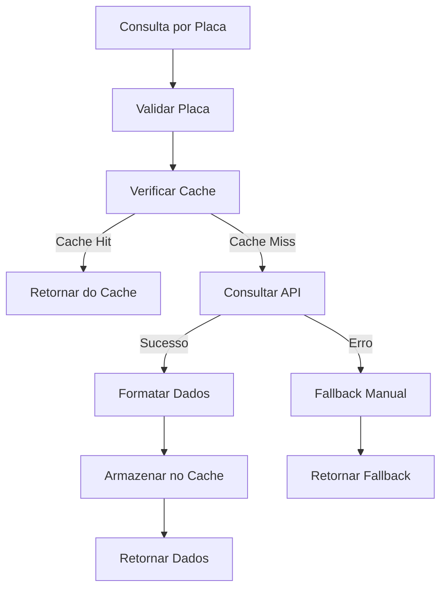

# 🚗 Serviço de API Veicular

## 📋 Visão Geral

O **ApiVeicularService** é responsável pela integração com a API externa `consultarplaca.com.br` para obtenção automática de dados de veículos a partir da placa. Este serviço implementa cache inteligente, fallback robusto e formatação de dados para o modelo do sistema.

## ✨ Funcionalidades

### ✅ **Implementadas**

- ✅ **Integração com API veicular** (consultarplaca.com.br)
- ✅ **Cache de 24 horas** para consultas repetidas
- ✅ **Formatação de dados** da API para nosso modelo
- ✅ **Tratamento de erros robusto** com fallback
- ✅ **Normalização de placas** (diferentes formatos)
- ✅ **Mapeamento de marcas e categorias**
- ✅ **Validação de dados** obrigatórios
- ✅ **Estatísticas de cache**
- ✅ **Limpeza de cache** seletiva

## 🔧 Configuração

### **Variáveis de Ambiente**

```bash
# .env
API_VEICULAR_KEY=sua_chave_da_api_aqui
```

### **Configuração no Sistema**

```javascript
// backend/src/config/env.js
API_VEICULAR_KEY: process.env.API_VEICULAR_KEY || "demo-key",
API_VEICULAR_BASE_URL: "https://api.consultarplaca.com.br/v1",
API_VEICULAR_TIMEOUT: 10000, // 10 segundos
API_VEICULAR_CACHE_TTL: 86400, // 24 horas
```

## 📚 Como Usar

### **1. Importação**

```javascript
const { apiVeicularService } = require("./src/services");
```

### **2. Consulta Básica**

```javascript
try {
  const dadosVeiculo = await apiVeicularService.consultarVeiculoPorPlaca(
    "ABC1234"
  );

  console.log("Dados obtidos:", dadosVeiculo);
  console.log("Origem dos dados:", dadosVeiculo.origem_dados);
} catch (error) {
  console.error("Erro na consulta:", error.message);
}
```

### **3. Integração no Controlador**

```javascript
// Exemplo de uso no controlador de solicitações
static async criarSolicitacao(req, res) {
  const { placa, ...outrosDados } = req.body;

  let dadosVeiculo = {};

  if (placa) {
    try {
      const dadosApi = await apiVeicularService.consultarVeiculoPorPlaca(placa);

      if (dadosApi.origem_dados === "api" || dadosApi.origem_dados === "cache") {
        // Usar dados da API
        dadosVeiculo = {
          marca: dadosApi.marca,
          modelo: dadosApi.modelo,
          ano_fabricacao: dadosApi.ano_fabricacao,
          // ... outros campos
        };
      } else {
        // Usar fallback
        dadosVeiculo = {
          marca: outrosDados.marca || "Não informado",
          modelo: outrosDados.modelo || "Não informado",
          // ... outros campos
        };
      }
    } catch (error) {
      // Tratar erro e usar dados manuais
      dadosVeiculo = { /* dados manuais */ };
    }
  }

  // Criar solicitação com dados obtidos
  const solicitacao = await Solicitacao.create({
    ...dadosVeiculo,
    // ... outros campos
  });
}
```

## 🔄 Fluxo de Funcionamento



## 📊 Estrutura de Dados

### **Entrada**

```javascript
const placa = "ABC1234"; // ou "ABC-1234"
```

### **Saída**

```javascript
{
  // Dados do veículo
  placa: "ABC1234",
  marca: "Volkswagen",
  modelo: "Golf",
  ano_fabricacao: 2020,
  ano_modelo: 2020,
  categoria: "carro",
  cor: "Branco",
  chassi: "9BWZZZ377VT004251",
  renavam: "12345678901",

  // Metadados
  origem_dados_veiculo: "api", // "api", "cache", "api_com_fallback", "manual"
  api_veicular_metadata: {
    consultado_em: "2024-09-21T01:55:04.933Z",
    api_original_data: { /* dados originais da API */ },
    versao_api: "1.0"
  },

  // Informações de origem
  origem_dados: "api", // "api", "cache", "api_com_fallback", "manual"
  timestamp_consulta: "2024-09-21T01:55:04.933Z"
}
```

## 🛡️ Tratamento de Erros

### **Tipos de Erro**

1. **API Indisponível** - Retorna fallback com dados mínimos
2. **Placa Inválida** - Validação antes da consulta
3. **Timeout** - Configurado para 10 segundos
4. **Dados Incompletos** - Fallback para dados manuais

### **Fallback Automático**

```javascript
// Se API falhar, retorna:
{
  placa: "ABC1234",
  marca: "Não informado",
  modelo: "Não informado",
  ano_fabricacao: 2025,
  ano_modelo: 2025,
  categoria: "outro",
  cor: "Não informado",
  chassi: "Não informado",
  renavam: "Não informado",
  origem_dados_veiculo: "api_com_fallback",
  api_veicular_metadata: {
    erro: {
      message: "API não disponível",
      timestamp: "2024-09-21T01:55:04.933Z",
      tipo: "api_indisponivel"
    },
    fallback_utilizado: true
  }
}
```

## ⚡ Cache

### **Configuração**

- **TTL**: 24 horas (86400 segundos)
- **Chave**: `veiculo_{PLACA}`
- **Armazenamento**: Memória (NodeCache)

### **Gerenciamento**

```javascript
// Obter estatísticas
const stats = apiVeicularService.obterEstatisticasCache();

// Limpar cache de uma placa
const removido = apiVeicularService.limparCachePlaca("ABC1234");

// Limpar todo o cache
const removidas = apiVeicularService.limparCache();
```

## 🧪 Testes

### **Executar Teste**

```bash
cd backend
node test-api-veicular-service.js
```

### **Teste Manual**

```javascript
const apiVeicularService = require("./src/services/apiVeicularService");

// Testar normalização
console.log(apiVeicularService.normalizarPlaca("abc-1234")); // "ABC1234"

// Testar configuração
console.log(apiVeicularService.verificarConfiguracao()); // true/false

// Testar consulta (modo demo)
const dados = await apiVeicularService.consultarVeiculoPorPlaca("ABC1234");
console.log(dados);
```

## 📋 Validações

### **Formato de Placa Aceito**

- ✅ `ABC1234` (Mercosul)
- ✅ `ABC-1234` (Mercosul com hífen)
- ✅ `abc-1234` (minúsculas)
- ❌ `1234ABC` (formato inválido)
- ❌ `ABC-123` (formato inválido)

### **Campos Obrigatórios**

- ✅ `placa`
- ✅ `marca`
- ✅ `modelo`
- ✅ `ano_fabricacao`
- ✅ `ano_modelo`
- ✅ `categoria`
- ✅ `cor`

## 🔧 Métodos Disponíveis

| Método                            | Descrição                        | Retorno        |
| --------------------------------- | -------------------------------- | -------------- |
| `consultarVeiculoPorPlaca(placa)` | Consulta dados do veículo        | `Object`       |
| `normalizarPlaca(placa)`          | Normaliza formato da placa       | `string\|null` |
| `verificarConfiguracao()`         | Verifica se API está configurada | `boolean`      |
| `limparCachePlaca(placa)`         | Remove placa do cache            | `boolean`      |
| `limparCache()`                   | Limpa todo o cache               | `number`       |
| `obterEstatisticasCache()`        | Estatísticas do cache            | `Object`       |

## 🚨 Pontos de Atenção

### **1. API Key**

- Configure a variável `API_VEICULAR_KEY` no ambiente
- Sem API key, o serviço funciona em modo demo com fallback

### **2. Rate Limiting**

- A API externa pode ter limites de requisições
- Use cache para evitar consultas desnecessárias

### **3. Timeout**

- Configurado para 10 segundos
- Ajuste conforme necessário no arquivo de configuração

### **4. Fallback**

- Sempre implemente fallback para dados manuais
- Não quebre o sistema se API estiver offline

## 📈 Performance

### **Otimizações**

- ✅ Cache de 24 horas
- ✅ Timeout configurável
- ✅ Validação antes da consulta
- ✅ Fallback rápido

### **Métricas**

- **Cache Hit**: Dados obtidos instantaneamente
- **Cache Miss**: Consulta à API (~1-3 segundos)
- **Fallback**: Dados mínimos instantâneos

---

**Este serviço garante que o sistema PeçaJá sempre funcione, mesmo com a API veicular offline, fornecendo uma experiência consistente aos usuários.**

